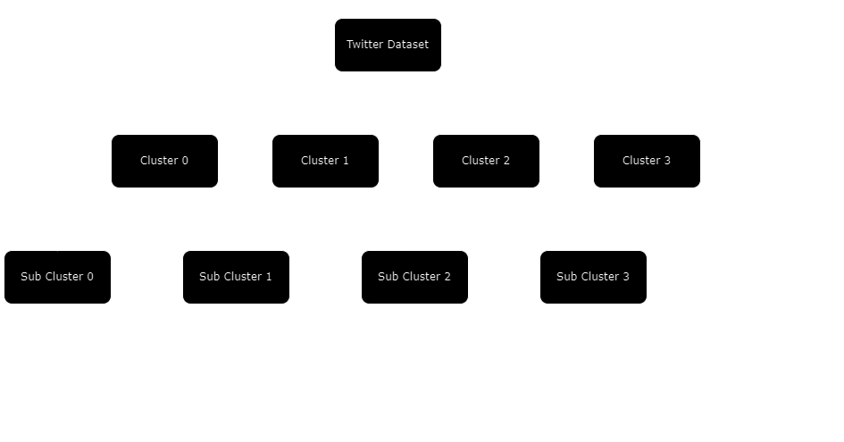

# Enhancing Content Discovery on Microblogging Sites

## Project Overview
Developed a new framework to improve how users find and explore content in online communities. This framework uses clustering, ranking, and Retrieval-Augmented Generation (RAG) to help users find content that matches their interests more efficiently.

## Here’s how it works:

- Starting Point: Users begin by selecting a tweet they're interested in.
- Clustering: The system groups similar tweets together into clusters, making it easy to browse related content.
- Ranking: Within each cluster, a ranking algorithm sorts tweets by relevance, helping users quickly find the most interesting posts.
- Enhanced Discovery: Using RAG, the system generates summaries or insights from these clusters, giving users useful information and tailored content recommendations.

This approach not only simplifies content discovery but also makes it more personal and relevant, enhancing user engagement in online communities.

### Operational Flow of Tweets Iterative Clustering and Ranking

## Screenshots

####Initial Clusters

## Methodology

Data Pipeline

![Result]
(Tweets_Preprocessing/Untitled Diagram.drawio (2).drawio.png)
## Results

![Result]
(Tweets_Preprocessing/WhatsApp Image 2024-04-30 at 9.28.13 PM.jpeg)
## Technologies used

- Python: The primary programming language used for developing the project.

- Scikit-Learn: Utilized for implementing machine learning algorithms for clustering.

- NLTK: Used for natural language processing tasks such as tokenization and stopwords removal.

- OpenAI API: Integrates advanced AI models for generating text summaries.

- Pandas & NumPy: Handle data manipulation and mathematical operations.

- LangChain: Incorporated to leverage its capabilities in chaining language models for complex workflows, enhancing the automation of generating coherent and contextually appropriate text outputs.
## Conclusion

This project outlines strategy to improve content discovery on platforms like Twitter and Reddit using Natural Language Processing (NLP) and Machine Learning (ML). Our method involved collecting and processing data to form semantic-rich text clusters, which help users find relevant and interesting content. We enhanced discovery with a ranking algorithm to highlight the most pertinent tweets and employed Retrieval Augmented Generation (RAG) for generating summaries and recommendations.

Results show that this approach effectively organizes content according to user interests and enhances engagement by providing clearer insights into community themes. This project ultimately aims to enrich user interactions and foster more vibrant online communities.
## Possible Future Works

- Using different clustering techniques.
- Improving RAG and whole model

